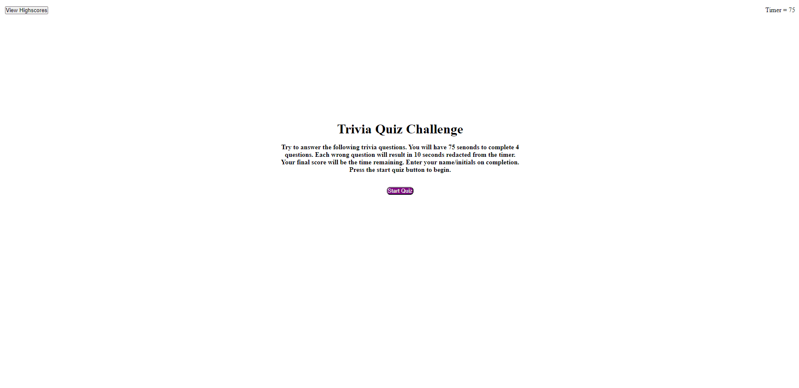

# Quizlet
This is a Javascript based quiz web application.

## Instructions for gameplay:

-Click on start quiz:

    - Timer will start to countdown from 75.
    - The first set of questions will populate.

-Answer a series of questions:

    - There are six questions total.
    - Any wrongly answered question will subtract 10 second from the timer.
    - After answering a question correctly or incorrectly, text will populate below the question telling the user if they're correct or wrong.
    - Users score is equal to the remaining time.

-Once either the timer reaches 0 or all the questions have been answered, the user will be shown a game over page. The page will have a submission form for the user to enter their initials or name.

-From the submit button, the user will be shown a list of highscores where they have the option to reset the highscores or return home.

## Language used:
-HTML
-CSS
-Javascript
## Demo:

Demo of the game playing through and highscore clearing:

## License:

No license.
## Links:

-Link to my [GitHub](https://github.com/idpetersen)

-Link to my [Repository](https://github.com/idpetersen/coding-quiz)
## Thank yous:

Thank you to Sabrina, Carter, Louis and everyone else for helping me with all things coding. Could not have done it without you guys. It takes a village... 

-Isaac Petersen